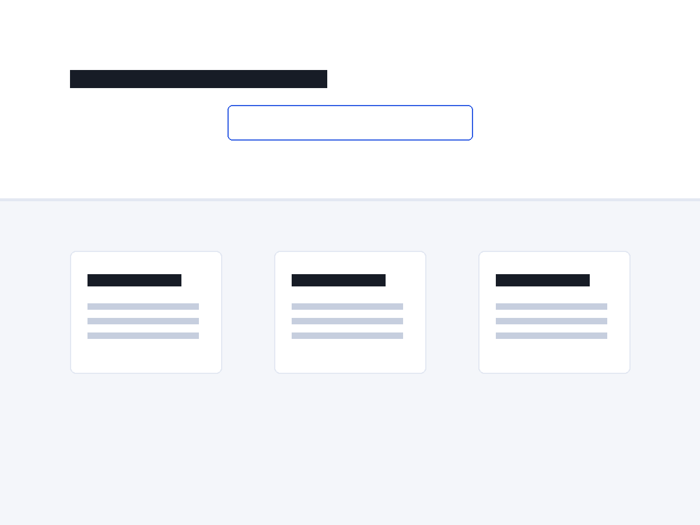

# Granth

A WordPress block theme for documentation and knowledge base sites.

Granth turns your page hierarchy into the site's structure: arrange pages with parent/child relationships and the docs sidebar builds itself. Add a search-first front page, callout boxes, careful long-form typography and code-friendly styling, and you have a documentation site running entirely on core blocks — no plugins required.



## Features

- **Docs sidebar from your page tree** — built with the Navigation block backed by a Page List, so it mirrors your page hierarchy automatically. Assign a menu to curate it manually.
- **Search-first front page** — full-width hero with a search form, plus a topic card grid generated from your top-level pages by a Query Loop.
- **Callout boxes** — Note, Tip and Warning styles for the Group block, themed through `theme.json` custom properties so they adapt to every style variation.
- **Code-ready typography** — Figtree for reading, JetBrains Mono for code, both bundled locally as variable fonts (no CDN requests). Fluid type scale tuned for long-form documentation at a 720px measure.
- **Style variations** — *Midnight* (dark, mono headings) and *Parchment* (warm, heavier serif-free headings, pill buttons).
- **Patterns** — hero with search, topic cards, callouts, FAQ with collapsible Details blocks, a code-heavy article starter offered on new pages, and a full front-page starter.
- **Templates** — two-column docs page, no-sidebar page, front page, search, 404 with search box, single, archive, index.
- **Accessible by default** — skip link, keyboard-navigable menus, sensible heading order, WCAG AA color contrast in all three color schemes.

## Requirements

- WordPress 6.5+
- PHP 7.4+

## Installation

**From a release:** download the zip from the [latest release](https://github.com/abhishekfdd/granth/releases), then in your admin go to *Appearance → Themes → Add New → Upload Theme*.

**From source:**

```bash
cd wp-content/themes
git clone https://github.com/abhishekfdd/granth.git
wp theme activate granth
```

## Getting started

1. Create your documentation as pages, nesting them with *Page Attributes → Parent*. The sidebar and the front-page topic grid pick the structure up automatically.
2. Set a static front page (or let the front-page template handle it) — the hero and topic cards come from the theme.
3. To write a landing-style page without the sidebar, pick the **Page (No Sidebar)** template in the page settings.
4. Try the style variations under *Appearance → Editor → Styles*.

## Theme structure

```
assets/fonts/     Figtree + JetBrains Mono (variable woff2, OFL licenses)
assets/css/       callout block styles
parts/            header, footer, docs sidebar
patterns/         visible patterns + hidden patterns holding translatable template strings
styles/           midnight.json, parchment.json
templates/        block templates
theme.json        design tokens — the source of truth
functions.php     block styles, pattern category, callout stylesheet
```

All user-facing strings live in PHP patterns (text domain `granth`), so the theme is fully translatable. `theme.json` stays at version 2 for WordPress 6.5 compatibility.

## License

GPLv2 or later. See [readme.txt](readme.txt) for full copyright and bundled font licenses:

- [Figtree](https://fonts.google.com/specimen/Figtree) — SIL OFL 1.1
- [JetBrains Mono](https://www.jetbrains.com/lp/mono/) — SIL OFL 1.1
